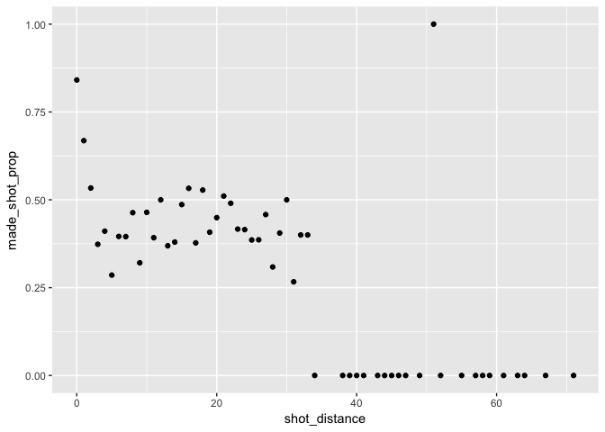
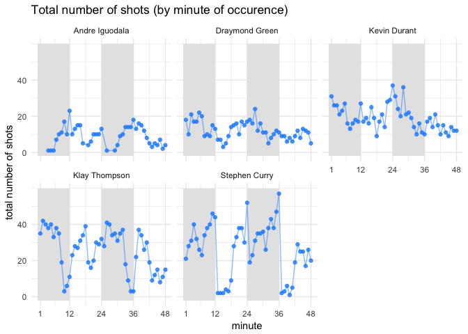

HW 02 - Shot Charts
================

Total Shots by Player
---------------------

``` r
library(dplyr)
```

    ## 
    ## Attaching package: 'dplyr'

    ## The following objects are masked from 'package:stats':
    ## 
    ##     filter, lag

    ## The following objects are masked from 'package:base':
    ## 
    ##     intersect, setdiff, setequal, union

``` r
library(readr)
library(ggplot2)

shots = read.csv('../data/shots-data.csv', stringsAsFactors = FALSE)
shots_tib = as_tibble(shots)

total_shots = shots_tib %>%
  group_by(name) %>%
  summarise(total = n()) %>%
  arrange(desc(total))
total_shots
```

    ## # A tibble: 5 x 2
    ##   name           total
    ##   <chr>          <int>
    ## 1 Stephen Curry   1250
    ## 2 Klay Thompson   1220
    ## 3 Kevin Durant     915
    ## 4 Draymond Green   578
    ## 5 Andre Iguodala   371

Effective Shooting Percentage
-----------------------------

``` r
# Effective Shooting % by Player

effective_shooting = shots_tib %>%
  group_by(name) %>%
  summarise(total = n(), made = sum(shot_made_flag == 'made shot')) %>%
  mutate(perc_made = made/total * 100) %>%
  arrange(desc(perc_made))
effective_shooting
```

    ## # A tibble: 5 x 4
    ##   name           total  made perc_made
    ##   <chr>          <int> <int>     <dbl>
    ## 1 Kevin Durant     915   495      54.1
    ## 2 Andre Iguodala   371   192      51.8
    ## 3 Klay Thompson   1220   575      47.1
    ## 4 Stephen Curry   1250   584      46.7
    ## 5 Draymond Green   578   245      42.4

``` r
# 2PT Effective Shooting % by Player
effective_shooting2PT = shots_tib %>%
  filter(shot_type == '2PT Field Goal') %>%
  group_by(name) %>%
  summarise(total2PT = n(), made2PT = sum(shot_made_flag == 'made shot')) %>%
  mutate(perc_made2PT = made2PT/total2PT * 100) %>%
  arrange(desc(perc_made2PT))
effective_shooting2PT
```

    ## # A tibble: 5 x 4
    ##   name           total2PT made2PT perc_made2PT
    ##   <chr>             <int>   <int>        <dbl>
    ## 1 Andre Iguodala      210     134         63.8
    ## 2 Kevin Durant        643     390         60.7
    ## 3 Stephen Curry       563     304         54.0
    ## 4 Klay Thompson       640     329         51.4
    ## 5 Draymond Green      346     171         49.4

``` r
# 3PT Effective Shooting % by Player
effective_shooting3PT = shots_tib %>%
  filter(shot_type == '3PT Field Goal') %>%
  group_by(name) %>%
  summarise(total3PT = n(), made3PT = sum(shot_made_flag == 'made shot')) %>%
  mutate(perc_made3PT = made3PT/total3PT * 100) %>%
  arrange(desc(perc_made3PT))
effective_shooting3PT
```

    ## # A tibble: 5 x 4
    ##   name           total3PT made3PT perc_made3PT
    ##   <chr>             <int>   <int>        <dbl>
    ## 1 Klay Thompson       580     246         42.4
    ## 2 Stephen Curry       687     280         40.8
    ## 3 Kevin Durant        272     105         38.6
    ## 4 Andre Iguodala      161      58         36.0
    ## 5 Draymond Green      232      74         31.9

Shooting Distance
-----------------

``` r
distances = shots_tib %>%
  group_by(shot_distance) %>%
  summarise(made_shot_prop = (sum(shot_made_flag == 'made shot')) / n())
distances
```

    ## # A tibble: 56 x 2
    ##    shot_distance made_shot_prop
    ##            <int>          <dbl>
    ##  1             0          0.841
    ##  2             1          0.668
    ##  3             2          0.534
    ##  4             3          0.373
    ##  5             4          0.411
    ##  6             5          0.286
    ##  7             6          0.396
    ##  8             7          0.395
    ##  9             8          0.463
    ## 10             9          0.321
    ## # ... with 46 more rows

``` r
ggplot(data = distances, aes(x = shot_distance, y = made_shot_prop)) +
  geom_point()
```



This scatterplot shows the proportion of made shots at each shot distance.

-   Observations:
    -   high proportion of shots made from very close to the basket (0 or 1 foot)
    -   generally within the same range of medium propotions (0.3 to 0.55) of shots made from 3 feet to 23 feet
    -   generally no shots made from distaces 24 feet or greater (with one outlier)
-   From the data, it can not be confirmed overall that the shorter the distance, the more effective shots. This can only be confirmed for extremely close shots.
-   Threshold beyond which chance of making a shot is pretty much 0: 35 feet
-   Distances 0 to 2 feet have a percentage of making the shot of above 50%. Some other specific distances have efficacy percentages of above 50%, but when looked at with the data points around them, it would not be expected that the range of percentages would be above 50%.

Total Number of Shots by Minute of Occurence
--------------------------------------------

``` r
shots_minute = shots_tib %>%
  group_by(name, minute) %>%
  summarise(shots_by_minute = n())
```

``` r
shots_by_min = ggplot(data = shots_minute, aes(x = minute, y = shots_by_minute)) +
  geom_rect(mapping = aes(xmin = 0, xmax = 12, ymin = -2, ymax = 60), fill = 'grey90') +
  geom_rect(mapping = aes(xmin = 24, xmax = 36, ymin = -2, ymax = 60), fill = 'grey90') +
  geom_point(color = 'dodgerblue', alpha = 0.8) +
  facet_wrap(~ name) +
  scale_x_continuous(breaks = c(1, 12, 24, 36, 48), limits = c(0, 48)) +
  theme_minimal() +
  scale_y_continuous(name = 'total number of shots', breaks = c(0, 20, 40), limits = c(-2, 60)) +
  geom_path(color = 'dodgerblue', alpha = 0.5) +
  ggtitle("Total number of shots (by minute of occurence)")
shots_by_min
```



This graphich shows the total number of shots taken at each minute of the game. It is facetted by player.
