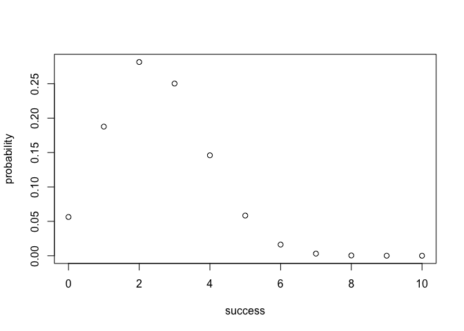
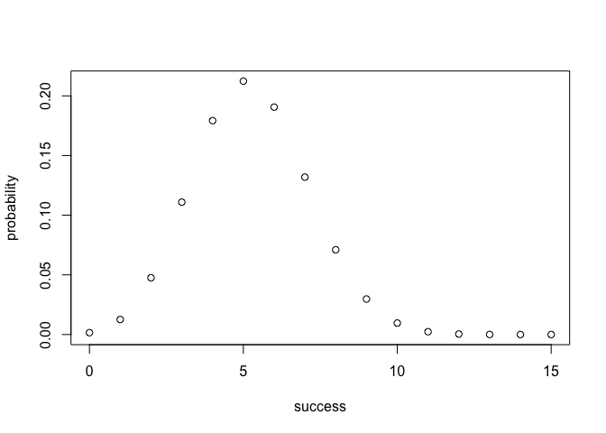

hw03-lindsey-chung.Rmd
================

Piping
======

### 2.1

``` bash

cut -f 2 -d "," nba2017-roster.csv | tail +2 | sort | uniq > team-names.txt

head -5 team-names.txt
```

    ## "ATL"
    ## "BOS"
    ## "BRK"
    ## "CHI"
    ## "CHO"

### 2.2

``` bash

cut -f 3 -d "," nba2017-roster.csv | tail +2 | sort | uniq > position-names.txt

head -5 position-names.txt
```

    ## "C"
    ## "PF"
    ## "PG"
    ## "SF"
    ## "SG"

### 2.3

``` bash

cut -f 7 -d "," nba2017-roster.csv | tail +2 | sort -n | uniq -c > experience-counts.txt

head -5 experience-counts.txt
```

    ##   80 0
    ##   52 1
    ##   46 2
    ##   36 3
    ##   35 4

### 2.4

``` bash

grep "player" nba2017-roster.csv > LAC.csv
grep "LAC" nba2017-roster.csv >> LAC.csv

cat LAC.csv
```

    ## "player","team","position","height","weight","age","experience","salary"
    ## "Alan Anderson","LAC","SF",78,220,34,7,1315448
    ## "Austin Rivers","LAC","SG",76,200,24,4,1.1e+07
    ## "Blake Griffin","LAC","PF",82,251,27,6,20140838
    ## "Brandon Bass","LAC","PF",80,250,31,11,1551659
    ## "Brice Johnson","LAC","PF",82,230,22,0,1273920
    ## "Chris Paul","LAC","PG",72,175,31,11,22868828
    ## "DeAndre Jordan","LAC","C",83,265,28,8,21165675
    ## "Diamond Stone","LAC","C",83,255,19,0,543471
    ## "J.J. Redick","LAC","SG",76,190,32,10,7377500
    ## "Jamal Crawford","LAC","SG",77,200,36,16,13253012
    ## "Luc Mbah a Moute","LAC","SF",80,230,30,8,2203000
    ## "Marreese Speights","LAC","C",82,255,29,8,1403611
    ## "Paul Pierce","LAC","SF",79,235,39,18,3500000
    ## "Raymond Felton","LAC","PG",73,205,32,11,1551659
    ## "Wesley Johnson","LAC","SF",79,215,29,6,5628000

### 2.5

``` bash

grep "LAL" nba2017-roster.csv | cut -f 6 -d "," | sort | uniq -c
```

    ##    2 19
    ##    1 20
    ##    2 22
    ##    3 24
    ##    2 25
    ##    2 30
    ##    2 31
    ##    1 37

### 2.6

``` bash

grep "CLE" nba2017-roster.csv | wc -l
```

    ##       15

### 2.7

``` bash

grep "player" nba2017-roster.csv | cut -f 1,4,5 -d "," > gsw-height-weight.csv

grep "GSW" nba2017-roster.csv | cut -f 1,4,5 -d "," >> gsw-height-weight.csv

cat gsw-height-weight.csv
```

    ## "player","height","weight"
    ## "Andre Iguodala",78,215
    ## "Damian Jones",84,245
    ## "David West",81,250
    ## "Draymond Green",79,230
    ## "Ian Clark",75,175
    ## "James Michael McAdoo",81,230
    ## "JaVale McGee",84,270
    ## "Kevin Durant",81,240
    ## "Kevon Looney",81,220
    ## "Klay Thompson",79,215
    ## "Matt Barnes",79,226
    ## "Patrick McCaw",79,185
    ## "Shaun Livingston",79,192
    ## "Stephen Curry",75,190
    ## "Zaza Pachulia",83,270

### 2.8

``` bash

grep "player" nba2017-roster.csv | cut -f 1,8 -d "," > top10-salaries.csv

cut -f 1,8 -d "," nba2017-roster.csv | tail +2 | sort -k 2 -r -n -t "," | head -10 >> top10-salaries.csv

cat top10-salaries.csv
```

    ## "player","salary"
    ## "LeBron James",30963450
    ## "Russell Westbrook",26540100
    ## "Mike Conley",26540100
    ## "Kevin Durant",26540100
    ## "James Harden",26540100
    ## "DeMar DeRozan",26540100
    ## "Al Horford",26540100
    ## "Carmelo Anthony",24559380
    ## "Damian Lillard",24328425
    ## "Dwyane Wade",23200000

Using Binomial Probability Functions
====================================

``` r
source('code/binomial-functions.R')

bin_probability(trials = 10, success = 3, prob = 1/6)
```

    ## [1] 0.1550454

``` r
loaded_six = bin_distribution(trials = 10, prob = 0.25)
plot(loaded_six)
```



This graph shows the probability of getting each number of sixes when tossing a loaded die 10 times with probability of getting six = 0.25

``` r
prob_head = 0
for (i in 4:5) {
  prob_add = bin_probability(trials = 5, success = i, prob = 0.35)
  prob_head = prob_head + prob_add
}
prob_head
```

    ## [1] 0.0540225

``` r
loaded_head = bin_distribution(trials = 15, prob = 0.35)
plot(loaded_head)
```



This graph shows the probability of getting each number of heads when tossing a loaded coin 15 times with probability of getting heads = 0.35
