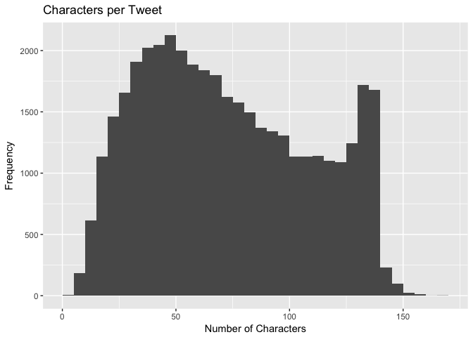
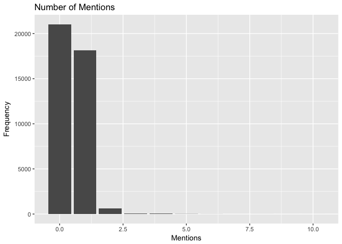
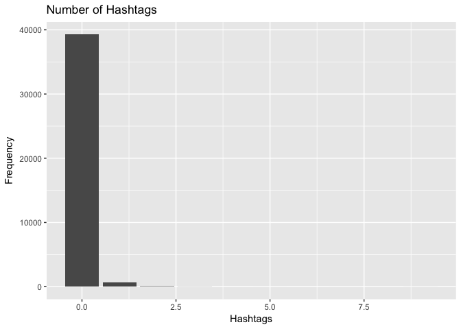

hw04-lindsey-chung
================

Archives
--------

``` r
library(readr)
library(dplyr)
```

    ## 
    ## Attaching package: 'dplyr'

    ## The following objects are masked from 'package:stats':
    ## 
    ##     filter, lag

    ## The following objects are masked from 'package:base':
    ## 
    ##     intersect, setdiff, setequal, union

``` r
source('../code/archive-functions.R')

raw_data = read_archive('stringr')
clean_data = clean_archive(raw_data)

png(filename = '../images/stringr-version-sizes.png')
plot_archive(clean_data)
dev.off()
```

    ## quartz_off_screen 
    ##                 2

``` r
write_csv(clean_data, '../data/stringr-archive.csv')

ggplot2_raw = read_archive('ggplot2')
ggplot2_clean = clean_archive(ggplot2_raw)
write_csv(ggplot2_clean, '../data/ggplot2-archive.csv')

xml_raw = read_archive('XML')
xml_clean = clean_archive(xml_raw)
write_csv(xml_clean, '../data/xml-archive.csv')

knitr_raw = read_archive('knitr')
knitr_clean = clean_archive(knitr_raw)
write_csv(knitr_clean, '../data/knitr-archive.csv')

dplyr_raw = read_archive('dplyr')
dplyr_clean = clean_archive(dplyr_raw)
write_csv(dplyr_clean, '../data/dplyr-archive.csv')
```

Plots
-----

``` r
complete_clean = rbind(ggplot2_clean, dplyr_clean)
complete_clean = rbind(complete_clean, xml_clean)
complete_clean = rbind(complete_clean, knitr_clean)

png(filename = '../images/version-sizes.png')
ggplot(data = group_by(complete_clean, name), aes(x = date, y = size)) +
  geom_step(aes(color = name)) +
  labs(y = 'size (kilobytes)', title = 'Timeline of Version Sizes')
dev.off()
```

    ## quartz_off_screen 
    ##                 2

``` r
png(filename = '../images/facet-version-sizes.png')
ggplot(data = group_by(complete_clean, name)) +
  geom_step(aes(x = date, y = size, color = name)) +
  facet_wrap( ~ name, scales = 'free') +
  labs(y = 'size (kilobytes)', title = 'Timelines of Version Sizes')
dev.off()
```

    ## quartz_off_screen 
    ##                 2

Regex Functions
---------------

``` r
source('../code/regex-functions.R')

split_chars('Go Bears!')
```

    ## [1] "G" "o" " " "B" "e" "a" "r" "s" "!"

``` r
split_chars('Expecto Patronum')
```

    ##  [1] "E" "x" "p" "e" "c" "t" "o" " " "P" "a" "t" "r" "o" "n" "u" "m"

``` r
vec <- c('G', 'o', ' ', 'B', 'e', 'a', 'r', 's', '!')
num_vowels(vec)
```

    ## a e i o u 
    ## 1 1 0 1 0

``` r
count_vowels('The quick brown fox jumps over the lazy dog')
```

    ## a e i o u 
    ## 1 3 1 4 2

``` r
count_vowels('THE QUICK BROWN FOX JUMPS OVER THE LAZY DOG')
```

    ## a e i o u 
    ## 1 3 1 4 2

``` r
reverse_chars('gattaca')
```

    ## [1] "acattag"

``` r
reverse_chars('Lumox Maxima')
```

    ## [1] "amixaM xomuL"

``` r
reverse_words('sentence! this reverse')
```

    ## [1] "reverse this sentence!"

``` r
reverse_words('string')
```

    ## [1] "string"

Data "Emotion in Text"
----------------------

``` r
dat = read_csv('../data/text-emotion.csv')
```

    ## Parsed with column specification:
    ## cols(
    ##   tweet_id = col_integer(),
    ##   sentiment = col_character(),
    ##   author = col_character(),
    ##   content = col_character()
    ## )

``` r
dat$chars = str_count(dat$content, '.')
summary(dat$chars)
```

    ##    Min. 1st Qu.  Median    Mean 3rd Qu.    Max. 
    ##    1.00   43.00   69.00   73.41  103.00  167.00

``` r
ggplot(data = dat) +
  geom_histogram(aes(x = chars), binwidth = 5, center = 2.5) +
  labs(x = 'Number of Characters', y = 'Frequency', title = 'Characters per Tweet')
```



``` r
dat$mentions = str_count(dat$content, '@\\w{1,15}')

table(dat$mentions)
```

    ## 
    ##     0     1     2     3     4     5     6     7     8     9    10 
    ## 21043 18162   649    86    34    16     5     1     2     1     1

``` r
ggplot(data = dat) +
  geom_bar(aes(x = mentions)) +
  labs(x = 'Mentions', y = 'Frequency', title = 'Number of Mentions')
```



``` r
filter(dat, mentions == 10) %>%
  select(content)
```

    ## # A tibble: 1 x 1
    ##   content                                                                 
    ##   <chr>                                                                   
    ## 1 last #ff  @Mel_Diesel @vja4041 @DemonFactory @shawnmcguirt @SEO_Web_Des…

``` r
dat$hashtags_count = str_count(dat$content, '#[:alpha:][:alnum:]+')

table(dat$hashtags_count)
```

    ## 
    ##     0     1     2     3     5     7     8     9 
    ## 39262   649    66    17     1     1     1     3

``` r
ggplot(data = dat) +
  geom_bar(aes(x = hashtags_count)) +
  labs(x = 'Hashtags', y = 'Frequency', title = 'Number of Hashtags')
```



``` r
hashtags = str_extract_all(dat$content, '#[:alpha:][:alnum:]+')

hashtags_nonzero = unlist(lapply(hashtags, function (x) if (length(x) == 0) NULL else x[[1]]))

hashtags_length = str_count(hashtags_nonzero, '.') - 1

mean(hashtags_length)
```

    ## [1] 7.723577

``` r
table(hashtags_length)
```

    ## hashtags_length
    ##  2  3  4  5  6  7  8  9 10 11 12 13 14 15 16 17 18 19 20 21 22 34 
    ## 69 61 75 63 45 64 62 57 48 53 57 18 18 24  7  6  3  2  2  2  1  1

``` r
max(table(hashtags_length))
```

    ## [1] 75

``` r
# Mode (most common) length is 4
```
